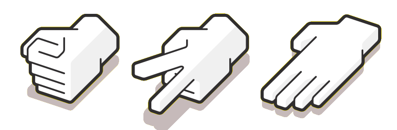
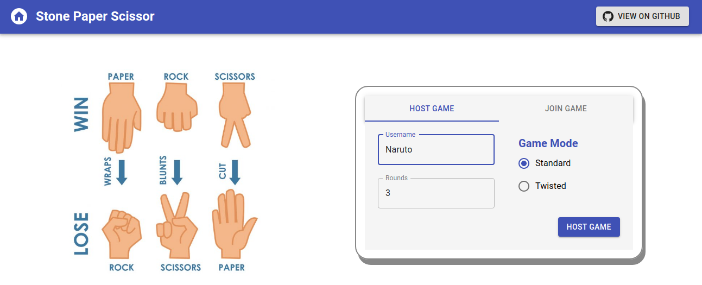
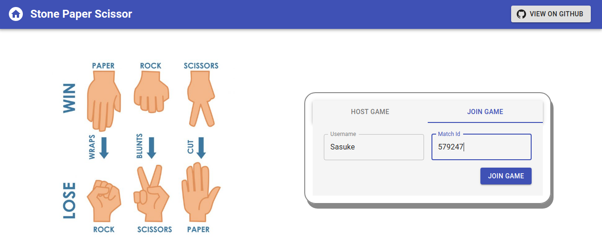
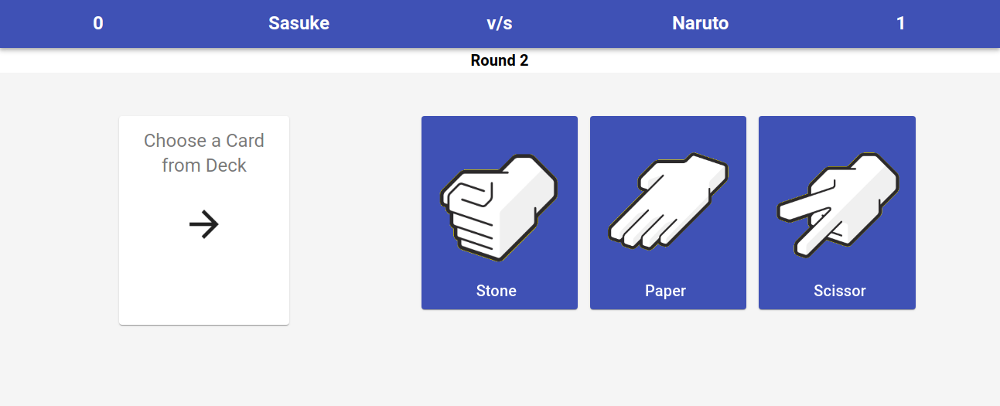
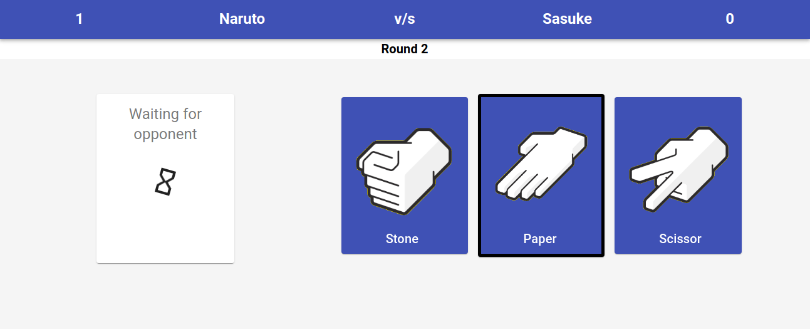
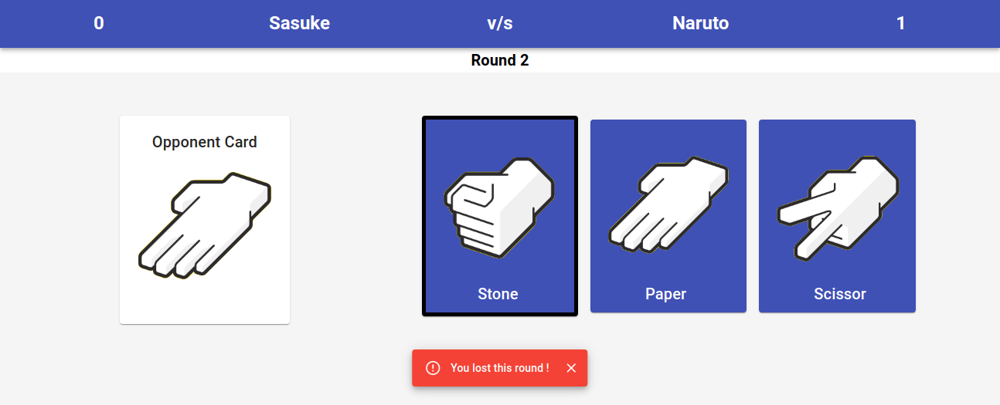
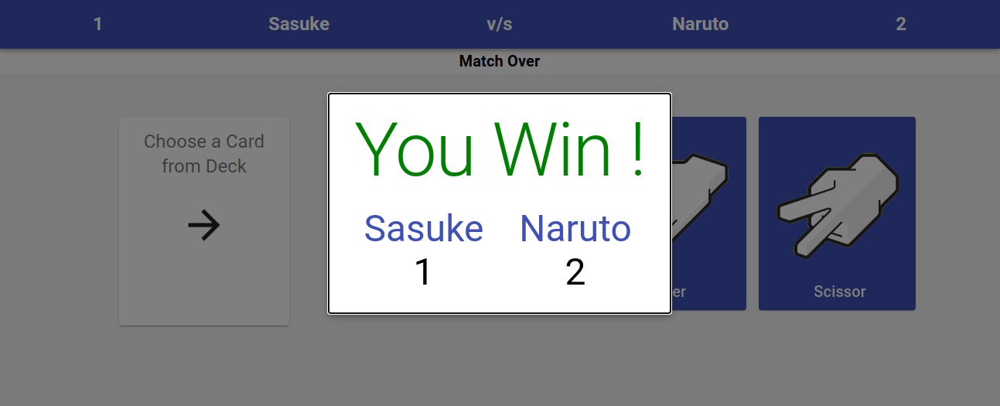

# StonePaperScissor
A game of Stone-Paper-Scissor built using `Nodejs`, `Express`, `React`, `Redis` and `Websockets`.
  

## Index 
1. [Features](#features)
2. [Deployment](#deployment)
   - [Docker build](#docker-build)
   - [Development build](#development-build)
   - [Production build](#production-build)
3. [Screenshots](#screenshots)

## Features
- No registration required
- Easy hosting/joining process
- Real-time gameplay

## Deployment
The three ways to deploy and run/test the application are listed below:

### Docker build
This build uses `docker-compose` to run the latest images of `stone-paper-scissor` and `redis`. The images are pulled from `Docker Hub`, if not present.

1. Navigate to *docker* folder from root directory.
2. Run `docker-compose up`. Add `sudo` if required.
3. Open the browser manually, and your deployment is now complete.

### Development build
This build launches the front-end and the back-end as separate `React` and `Nodejs` applications. This build is not optimized for production and is suitable for development/testing purposes.

1. Start `Redis` on your system using the command `redis-server`. The default port is `6379`.
2. Navigate to the folder *back-end* and run command `npm ci && npm start`. 
3. You will see a success message of server running and redis connected.
4. Navigate to *front-end* folder from root directory.
5. Inside the *front-end* folder, run command `npm ci && npm start`.
6. The browser window will open, and your deployment is now complete.

### Production build
This build serves the front-end built in `React` as static content and the back-end as `Nodejs` application. This build is optimized for production.

1. Start `Redis` on your system using the command `redis-server`. The default port is `6379`.
2. Navigate to *front-end* folder from root directory.
3. Inside the *front-end* folder, run command `npm ci && npm run build`. It will generate a folder named *build* in current directory.
4. Copy the *build* folder inside the *back-end* folder in the root directory.
5. Open `props.js` and change the value of `ENVIRONMENT` to `PRODUCTION`.
6. Inside the *back-end* folder, run command `npm ci && npm start`. 
7. You will see a success message of server running and redis connected.
8. Open the browser manually, and your deployment is now complete.

## Screenshots

| | |
|:-------------------------:|:-------------------------:|
| | |
| Host Screen | Join Screen |
| | |
| | |
| Player Turn | Opponent Turn |
| | |
| | |
| Round Over | Game Over |
| | |
